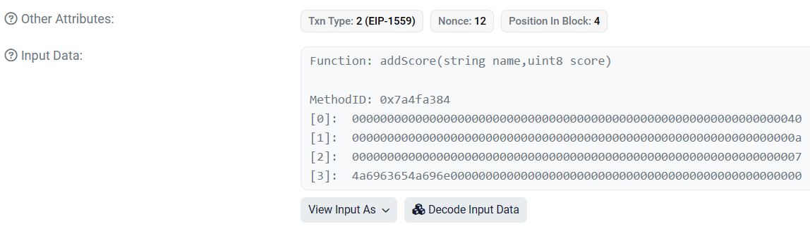
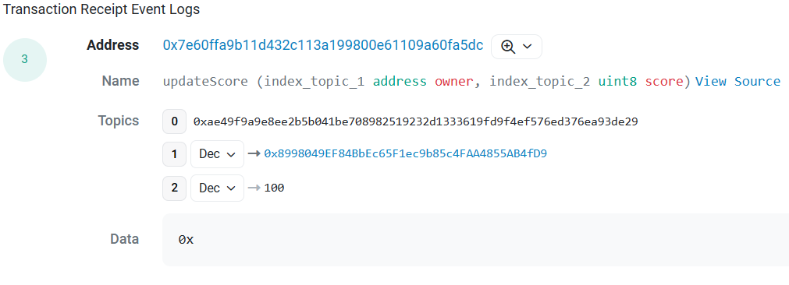

# w2_2作业<br>

## 已部署的合约<br>


| Sepolia      |     |
| :---        | ---: |
| Teacher      | 0x07f470F7793FeFb0F0602bAfC783023c81F5aE44|
| Student   | 0x7E60Ffa9b11d432c113a199800E61109a60FA5Dc    | <br>

<br>

---

<br>

## Contracts
## Teacher.sol
```
// SPDX-License-Identifier: GPL-3.0

pragma solidity ^0.8.0;

interface IStudent{
    function addScore(uint8 num) external;

    function modifyScore(uint8 num) external;
}

contract Teacher{
    address public owner;
    mapping(string => address) public students;

    event Claim(string indexed name,address indexed at);

    constructor(){
        owner = msg.sender;
    }

    modifier mustOwner{
        require(msg.sender == owner,"You can not modify score!");
        _;
    }

    function claim(string memory student) external {
        students[student] = msg.sender;
        emit Claim(student, msg.sender);
    }

    function addScore(string memory name,uint8 score) external mustOwner{
        address student_address = students[name];
        IStudent student = IStudent(student_address);
        student.addScore(score);
    }

    function modifyScore(string memory name,uint8 score) external mustOwner{
        address student_address = students[name];
        IStudent student = IStudent(student_address);
        student.modifyScore(score);
    }
}
```
<br>

---

<br>

## Student.sol
```
// SPDX-License-Identifier: GPL-3.0

pragma solidity ^0.8.0;

contract Student{
    string public name;
    uint8 public score;
    address public owner;
    address public teacher;

    error overScore();

    event Relationship(address indexed owner,address indexed teacher);
    event updateScore(address indexed owner,uint8 indexed score);
    
    constructor(string memory stude,address teach){
        name = stude;
        teacher = teach;
        owner = msg.sender;
        require(isContract(teacher),"Teacher must be a contract");
        (bool success, ) = teacher.call(abi.encodeWithSignature("claim(string)", name));
        require(success,"claim failure");
        emit Relationship(owner, teach);
    }

    modifier mustTeacher{
        require(msg.sender == teacher,"You are not the teacher!");
        _;
    }

    function isContract(address target) internal view returns(bool){
        uint256 codeSize;
        assembly{
            codeSize := extcodesize(target)
        }
        return codeSize > 0;
    }

    function addScore(uint8 num) external mustTeacher{
        if(score + num > 100){
            revert overScore();
        }
        score += num;
        emit updateScore(owner, score);
    } 

    function modifyScore(uint8 num) external mustTeacher{
        if(num > 100){
            revert overScore();
        }
        score = num;
        emit updateScore(owner, score);
    }
}
```

<br>

---

<br>

## Test<br>
## interact.js<br>
```
const {loadFixture}  = require("@nomicfoundation/hardhat-network-helpers");
const {anyValue} = require("@nomicfoundation/hardhat-chai-matchers/withArgs");
const {expect} = require("chai");
const hre = require("hardhat");
const { deepCopy } = require("ethers/lib/utils");

describe("Teacher interact with Student",function(){
    async function deployTeacherAndStudent(){
        const name = "JiceJin";

        const Teacher = await hre.ethers.getContractFactory("Teacher");
        const teacher = await Teacher.deploy();

        const [owner,otherAccount] = await hre.ethers.getSigners();

        const Student = await hre.ethers.getContractFactory("Student");
        const student = await Student.connect(otherAccount).deploy(name,teacher.address);

        return {teacher,student,owner,otherAccount,name,Student};
    }
    describe("Deployment",function(){
        describe("Teacher's Deployment",function(){
            it("set right owner",async function(){
                const {teacher,owner} = await loadFixture(deployTeacherAndStudent);
                expect(await teacher.owner()).to.equal(owner.address);
            });
        });
        describe("Student's Deployment",function(){
            it("set right name",async function(){
                const {student,name} = await loadFixture(deployTeacherAndStudent);
                expect(await student.name()).to.equal(name);
            });
            it("set right teacher",async function(){
                const {student,teacher} = await loadFixture(deployTeacherAndStudent);
                expect(await student.teacher()).to.equal(teacher.address);
            });
            it("set right owner",async function(){
                const {student,otherAccount} = await loadFixture(deployTeacherAndStudent);
                expect(await student.owner()).to.equal(otherAccount.address);
            });
            it("check if JiceJin is in teacher's mapping",async function(){
                const {student,teacher,name} = await loadFixture(deployTeacherAndStudent);
                expect(await teacher.students(name)).to.equal(student.address);
            });
            it("Should revert that isContract false",async function(){          //部署时的revert的测试，要使用这种重新部署的方式去测试
                const {owner,name} = await loadFixture(deployTeacherAndStudent);
                const Student = await hre.ethers.getContractFactory("Student");
                await expect(Student.deploy(name,owner.address)).to.be.revertedWith("Teacher must be a contract");
            });
            it("Should not revert that isContract true",async function(){       //部署时的revert的测试，要使用这种重新部署的方式去测试
                const {teacher,name} = await loadFixture(deployTeacherAndStudent);
                const Student = await hre.ethers.getContractFactory("Student");
                await expect(Student.deploy(name,teacher.address)).not.to.be.reverted;
            });
            it("Should revert that Call failure",async function(){              //部署时的revert的测试，要使用这种重新部署的方式去测试
                const {student,name} = await loadFixture(deployTeacherAndStudent);
                const Student = await hre.ethers.getContractFactory("Student");
                await expect(Student.deploy(name,student.address)).to.be.revertedWith("claim failure");
            });
            it("Should emit Relationship event",async function(){               //部署时的event的测试,要用到deployTransaction属性
                const {student,otherAccount,teacher} = await loadFixture(deployTeacherAndStudent);
                await expect(student.deployTransaction).to.emit(student,"Relationship").withArgs(
                    otherAccount.address,teacher.address
                    );
            });
        });
    });
    describe("Modifiers",function(){
        describe("Teacher's mustOwner AND Student's mustTeacher",function(){
            it("should be reverted addScore",async function(){
                const {otherAccount,teacher,name} = await loadFixture(deployTeacherAndStudent);
                await expect(teacher.connect(otherAccount).addScore(name,1)).to.be.revertedWith("You can not modify score!");
            })
            it("should not be reverted addScore -> should not be reverted addScore in Student",async function(){
                const {teacher,name} = await loadFixture(deployTeacherAndStudent);
                await expect(teacher.addScore(name,1)).not.to.be.reverted;
            })
            it("should be reverted modifyScore",async function(){
                const {otherAccount,teacher,name} = await loadFixture(deployTeacherAndStudent);
                await expect(teacher.connect(otherAccount).modifyScore(name,1)).to.be.revertedWith("You can not modify score!");
            })
            it("should not be reverted modifyScore -> should not be reverted modifyScore in Student",async function(){
                const {teacher,name} = await loadFixture(deployTeacherAndStudent);
                await expect(teacher.modifyScore(name,1)).not.to.be.reverted;
            })
            it("should be reverted addScore in Student",async function(){
                const {student,otherAccount} = await loadFixture(deployTeacherAndStudent);
                await expect(student.connect(otherAccount).addScore(1)).to.be.revertedWith("You are not the teacher!")
            })
            it("should be reverted modifyScore in Student",async function(){
                const {student,otherAccount} = await loadFixture(deployTeacherAndStudent);
                await expect(student.connect(otherAccount).modifyScore(1)).to.be.revertedWith("You are not the teacher!")
            })
        })
    })
    describe("Functions",function(){
        describe("addScore",function(){
            it("should be reverted because score > 100",async function(){
                const {teacher,student,name} = await loadFixture(deployTeacherAndStudent);
                await expect(teacher.addScore(name,101)).to.be.revertedWithCustomError(student,"overScore");
            })
            it("Student's score should update",async function(){
                const {student,teacher,name} = await loadFixture(deployTeacherAndStudent);
                const beforeScore = await student.score();
                const scoreToSet = 100
                const afterScore = beforeScore + scoreToSet;
                await teacher.addScore(name,scoreToSet);
                expect(await student.score()).to.equal(afterScore);
            })
            it("should emit updateScore event",async function(){
                const {student,teacher,name} = await loadFixture(deployTeacherAndStudent);
                const scoreToSet = 100
                await expect(teacher.addScore(name,scoreToSet)).to.emit(student,"updateScore").withArgs(
                    await student.owner(),
                    await student.score()
                );
            })
        })
        describe("modifyScore",function(){
            it("should be reverted because score > 100",async function(){
                const {student,teacher,name} = await loadFixture(deployTeacherAndStudent);
                await expect(teacher.modifyScore(name,101)).to.be.revertedWithCustomError(student,"overScore");
            })
            it("Student's score should equal to the value setting",async function(){
                const {student,teacher,name} = await loadFixture(deployTeacherAndStudent);
                const scoreToSet = 100;
                await teacher.modifyScore(name,scoreToSet);
                expect(await student.score()).to.equal(scoreToSet);
            })
            it("should emit updateScore event",async function(){
                const {student,teacher,name,otherAccount} = await loadFixture(deployTeacherAndStudent);
                const scoreToSet = 100;
                await expect(teacher.modifyScore(name,scoreToSet)).to.emit(student,"updateScore").withArgs(
                    await student.owner(),
                    await student.score()
                );
            })
        })
    })
})
```

<br>

---

<br>

## Images<br>
### Teacher部署<br>
<br>

### Student部署<br>
<br>

### 调用Teacher的addScore方法<br>
<br>

### updateScore日志<br>
<br>

