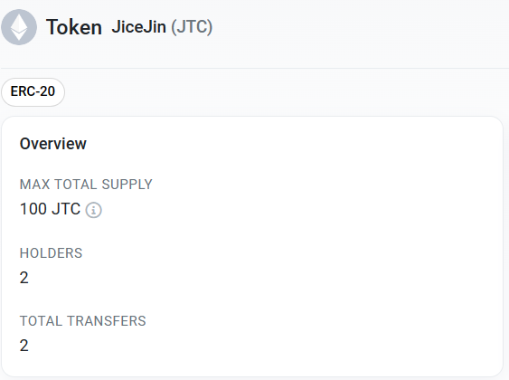
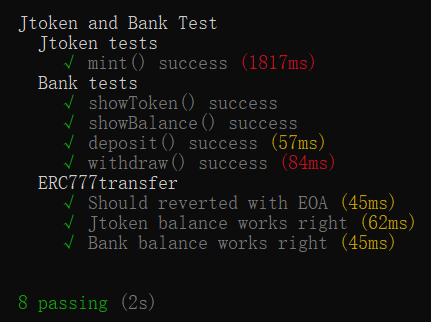

# 已部署的合约：

|Goerli|      |
| :--- | ---: |
|Token: |0x4e5EE78D23099956c55C84cd274E354539404c60|
|Bank: |0xf1dA3CEDeD19e6EaA08b44fbD1EF84aEef87cb13|<br>

Token部署交易：<br>

<br>

Bank部署交易：<br>

<br>

Jtoken：<br>

<br>


## Jtoken.sol:<br>

```
    contract Jtoken is ERC20, ReentrancyGuard{
    using Address for address;

    address private _owner;

    constructor(string memory name_, string memory symbol_) ERC20(name_, symbol_){
        _owner = _msgSender();
    }

    modifier OnlyOwner{
        require(_msgSender() == _owner, "Jtoken: ONLY OWNER");
        _;
    }

    function mint(address account, uint256 amount) external OnlyOwner returns (bool){
        _mint(account, amount);
        return true;
    }

    function ERC777transfer(address to, uint256 amount) external nonReentrant returns(bool){
        bool success;
        bool returnSuccess;
        bytes memory data;
        require(to.isContract(),"Jtoken: CANNOT EOA");
        success = transfer(to, amount);
        require(success, "Jtoken: Transfer fail");
        (success, data) = to.call(abi.encodeWithSignature("ERC777deposit(address,uint256)", msg.sender,amount));
        returnSuccess = abi.decode(data,(bool));
        require(success && returnSuccess,"Jtoken: ERC777deposit fail");
        return true;
    }
}
```
<br>

## Bank.sol<br>

```
    contract Bank{
    using SafeERC20 for ERC20;

    mapping(address => uint256) private balance;
    ERC20 private token;

    constructor(address _token){
        token = ERC20(_token);
    }

    modifier OnlyToken{
        require(msg.sender == address(token),"ONLY TOKEN");
        _;
    }
    
    function showToken() public view returns (string memory){
        return token.symbol();
    }

    function showBalance(address account) public view returns (uint256){
        return balance[account];
    }

    function deposit(uint256 amount) external returns (bool){
        bool success = token.transferFrom(msg.sender,address(this),amount);
        require(success,"deposit fail");
        balance[msg.sender] += amount;
        return true;
    }

    function withdraw(uint256 amount) external returns (bool){
        uint256 value = balance[msg.sender];
        require(value >= amount,"Exceed balance");
        balance[msg.sender] -= amount;
        token.safeTransfer(msg.sender,amount);
        return true;
    }

    function ERC777deposit(address to, uint256 amount) external OnlyToken returns (bool){
        balance[to] += amount;
        return true;
    }
}

```

## test results<br>



## test code<br>

```
    const {loadFixture}  = require("@nomicfoundation/hardhat-network-helpers");
const {anyValue} = require("@nomicfoundation/hardhat-chai-matchers/withArgs");
const {expect} = require("chai");
const hre = require("hardhat");
const { deepCopy } = require("ethers/lib/utils");
const { BigNumber } = require("ethers");

describe("Jtoken and Bank Test",function(){
    async function deployJtokenandBank(){
        const name = "JiceJin";
        const symbol = "JTC";
        const [first,second] = await hre.ethers.getSigners();
        const Jtoken = await hre.ethers.getContractFactory("Jtoken");
        const jtoken = await Jtoken.deploy(name,symbol);

        const Bank = await hre.ethers.getContractFactory("Bank");
        const bank = await Bank.deploy(jtoken.address);

        await (await jtoken.mint(first.address,BigNumber.from("100000000000000000000"))).wait();

        return {jtoken,bank,first,second,symbol};
    }
    describe("Jtoken tests",function(){
        it("mint() success",async function(){
            const {jtoken,first} = await loadFixture(deployJtokenandBank);
            const beforeMint_string = await jtoken.balanceOf(first.address);
            const beforeMint = BigNumber.from(beforeMint_string);
            await (await jtoken.mint(first.address,100)).wait();
            const afterMint = await jtoken.balanceOf(first.address);
            expect(beforeMint.add(100)).to.equal(afterMint);
        })
    })
    describe("Bank tests",function(){
        it("showToken() success",async function(){
            const {bank,symbol} = await loadFixture(deployJtokenandBank);
            expect(await bank.showToken()).to.equal(symbol);
        })
        it("showBalance() success",async function(){
            const {bank,first} = await loadFixture(deployJtokenandBank);
            expect(await bank.showBalance(first.address)).to.equal(0);
        })
        it("deposit() success",async function(){
            const {bank,jtoken,first} = await loadFixture(deployJtokenandBank);
            await (await jtoken.approve(bank.address,5000)).wait();
            await (await bank.deposit(5000)).wait();
            expect(await bank.showBalance(first.address)).to.equal(5000);
        })
        it("withdraw() success",async function(){
            const {bank,jtoken,first} = await loadFixture(deployJtokenandBank);
            await (await jtoken.approve(bank.address,5000)).wait();
            await (await bank.deposit(5000)).wait();
            await (await bank.withdraw(2500)).wait();
            expect(await bank.showBalance(first.address)).to.equal(2500);
        })
    })
    describe("ERC777transfer",function(){
        it("Should reverted with EOA",async function(){
            const {jtoken,second} = await loadFixture(deployJtokenandBank);
            await expect(jtoken.ERC777transfer(second.address,100)).to.be.revertedWith("Jtoken: CANNOT EOA");
        })
        it("Jtoken balance works right",async function(){
            const {bank,jtoken,first} = await loadFixture(deployJtokenandBank);
            const beforeBalance_first = BigNumber.from(await jtoken.balanceOf(first.address));
            const beforeBalance_bank = BigNumber.from(await jtoken.balanceOf(bank.address));
            await (await jtoken.ERC777transfer(bank.address,100)).wait();
            const afterBalance_first = await jtoken.balanceOf(first.address);
            const afterBalance_bank = await jtoken.balanceOf(bank.address);
            expect(beforeBalance_first.sub(100)).to.equal(afterBalance_first);
            expect(beforeBalance_bank.add(100)).to.equal(afterBalance_bank);
        })
        it("Bank balance works right",async function(){
            const {bank,jtoken,first} = await loadFixture(deployJtokenandBank);
            const beforeBalance = BigNumber.from(await bank.showBalance(first.address));
            await (await jtoken.ERC777transfer(bank.address,100)).wait();
            const afterBalance = BigNumber.from(await bank.showBalance(first.address));
            expect(beforeBalance.add(100)).to.equal(afterBalance);
        })
    })
})
```