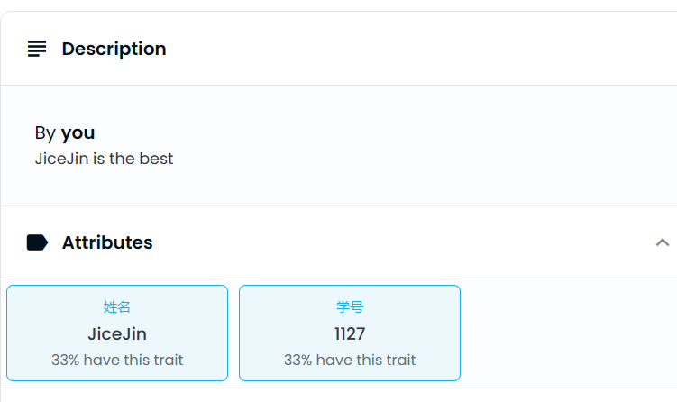
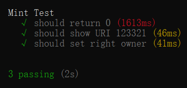
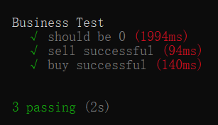

# 部署合约:<br>
|Goerli||
|---|---|
|Jtoken(ERC20)|0x4e5EE78D23099956c55C84cd274E354539404c60|
|JNFT(ERC721)|0xe49dC5fE6Aac3AD4517111C02bd0FdB01d6D5620|
|Business(Market)|0x8170D9E5F1a94EfC183cE784D092c5dE200Fa827|<br>

## Opensea<br>

<br>

## 图片信息<br>

<br>

## 成功交易后，拥有者改变<br>

<br>

## Jtoken.sol:<br>

```
    contract Jtoken is ERC20, ReentrancyGuard{
    using Address for address;

    address private _owner;

    constructor(string memory name_, string memory symbol_) ERC20(name_, symbol_){
        _owner = _msgSender();
    }

    modifier OnlyOwner{
        require(_msgSender() == _owner, "Jtoken: ONLY OWNER");
        _;
    }

    function mint(address account, uint256 amount) external OnlyOwner returns (bool){
        _mint(account, amount);
        return true;
    }

    function ERC777transfer(address to, uint256 amount) external nonReentrant returns(bool){
        bool success;
        bool returnSuccess;
        bytes memory data;
        require(to.isContract(),"Jtoken: CANNOT EOA");
        success = transfer(to, amount);
        require(success, "Jtoken: Transfer fail");
        (success, data) = to.call(abi.encodeWithSignature("ERC777deposit(address,uint256)", msg.sender,amount));
        returnSuccess = abi.decode(data,(bool));
        require(success && returnSuccess,"Jtoken: ERC777deposit fail");
        return true;
    }
}
```

## JNFT.sol<br>

```
    contract JNFT  is ERC721URIStorage{
    using Counters for Counters.Counter;

    Counters.Counter private _tokenId;
    address private _owner;

    constructor(string memory name_, string memory symbol_) ERC721(name_,symbol_){
        _owner = _msgSender();
    }


    function mint(address to, string memory tokenURI) external returns (uint256){
        require(_msgSender() == _owner,"JNFT: ONLY OWNER CAN MINT");
        uint256 currentId = _tokenId.current();
        _mint(to,currentId);
        _setTokenURI(currentId,tokenURI);
        _tokenId.increment();
        return currentId;
    }
}

```

## Business.sol<br>

```
    contract Business is IERC721Receiver{
    IERC20 public token;
    IERC721 public nft;
    mapping(uint256 => uint256) public price;
    mapping(uint256 => address) public seller;

    constructor(address token_, address nft_){
        token = IERC20(token_);
        nft = IERC721(nft_);
    }

    function onERC721Received(
        address operator,
        address from,
        uint256 tokenId,
        bytes calldata data
    ) external pure override returns (bytes4) {
      return this.onERC721Received.selector;
    }

    function getPrice(uint256 tokenID) public view returns(uint256){
        return price[tokenID];
    }

    function sell(uint256 tokenID, uint amount) public {
        nft.safeTransferFrom(msg.sender,address(this),tokenID);
        price[tokenID] = amount;
        seller[tokenID] = msg.sender;
    }

    function buy(uint256 tokenID) public {
        uint256 amount = price[tokenID];
        address vendor = seller[tokenID];

        require(amount!=0 || vendor!=address(0),"this nft doesn't exist in the market");

        bool success = token.transferFrom(msg.sender, address(vendor), amount);
        require(success,"Transfer ERC20 fail");
        nft.transferFrom(address(this), msg.sender, tokenID);

        delete price[tokenID];
        delete seller[tokenID];
    }
}
```

# 测试

## JNFT.js<br>

<br>

```
    describe("Mint Test",function(){
    async function deployJNFT(){
        const JNFT = await hre.ethers.getContractFactory("JNFT");
        const jnft = await JNFT.deploy("学院卡","JNFT");
        const [first,second] = await hre.ethers.getSigners();
        return {jnft,first,second};
    }
    it("should return 0",async function(){
        const {jnft,first} = await loadFixture(deployJNFT);
        const result = await jnft.mint(first.address,"123321");// 要修改状态变量并且有返回值的函数，要取到返回值需要用到value属性
        expect(result.value).to.equal(0);
    })
    it("should show URI 123321",async function(){
        const {jnft,first} = await loadFixture(deployJNFT);
        const result = await jnft.mint(first.address,"123321");
        expect(await jnft.tokenURI(result.value)).to.equal("123321");
    })
    it("should set right owner",async function(){
        const {jnft,first} = await loadFixture(deployJNFT);
        const result = await jnft.mint(first.address,"123321");
        expect(await jnft.ownerOf(result.value)).to.equal(first.address);
    })
})
```
---

## Business.js<br>

<br>

```
    describe("Business Test",function(){
    async function deployBusiness(){
        const JNFT = await hre.ethers.getContractFactory("JNFT");
        const jnft = await JNFT.deploy("1111","22");
        
        const Jtoken = await hre.ethers.getContractFactory("Jtoken");
        const jtoken = await Jtoken.deploy("3333","44");

        const Business = await hre.ethers.getContractFactory("Business");
        const business = await Business.deploy(jtoken.address,jnft.address);

        const [first,second] = await hre.ethers.getSigners();

        await (await jtoken.mint(second.address,10000)).wait();
        await (await jnft.mint(first.address,"")).wait(); 

        return {jnft,jtoken,business,first,second};
    }
    it("should be 0",async function(){
        const {business} = await loadFixture(deployBusiness);
        expect(await business.getPrice(0)).to.equal(0);
    })
    it("sell successful",async function(){
        const {jnft,business,first} = await loadFixture(deployBusiness);
        await jnft.approve(business.address,0);
        await business.sell(0,1000);
        expect(await jnft.ownerOf(0)).to.equal(business.address);
        expect(await business.price(0)).to.equal(1000);
        expect(await business.seller(0)).to.equal(first.address);
    })
    it("buy successful",async function(){
        const {jnft,jtoken,business,first,second} = await loadFixture(deployBusiness);
        //sell
        await jnft.approve(business.address,0);
        await business.sell(0,1000);
        //buy
        await jtoken.connect(second).approve(business.address,1000);
        await business.connect(second).buy(0);
        expect(await jtoken.allowance(second.address,business.address)).to.equal(0);
        expect(await jtoken.balanceOf(first.address)).to.equal(1000);
        expect(await jnft.ownerOf(0)).to.equal(second.address);
        expect(await business.price(0)).to.equal(0);
        expect(await business.seller(0)).to.equal("0x0000000000000000000000000000000000000000");
    })
})
```