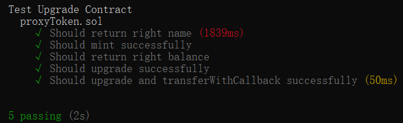

# 合约部署地址

|Goerli||
|---|---|
|proxyToken|0x148E0b4ad8476aC814b8d97644555a080e5CC427|
|token|0x915380d560db499648a3f3997F51Ac953C258A67|
|tokenV2|0x3C7C1fFd13af404bbA9d811AF97bDBEAF7275d91|<br>

# 合约<br>

## proxyToken<br>

```
    contract proxyToken {

    mapping(address => uint256) private _balances;

    mapping(address => mapping(address => uint256)) private _allowances;

    uint256 private _totalSupply;

    string private _name;
    string private _symbol;

    address private _logic;
    address private _owner;

    constructor(string memory name_,string memory symbol_){
        _name = name_;
        _symbol = symbol_;
        _owner = msg.sender;
    }

    fallback() external payable{
        // (bool success,bytes memory data) = _logic.delegatecall(msg.data);
        // require(success,"delegatecall fail");
        // success = abi.decode(data,(bool));
        // require(success,"ERC20 operate fail");
        // emit showsuccess(success);
    }

    receive() external payable{}


    function name() public returns (string memory n){
        bytes memory callData = abi.encodeWithSignature("name()");
        (bool success,bytes memory data) = _logic.delegatecall(callData);
        require(success,"delegatecall fail");
        n = abi.decode(data,(string));
        emit showname(n);
        return n;
    }

    function symbol() public returns (string memory n) {
        bytes memory callData = abi.encodeWithSignature("symbol()");
        (bool success,bytes memory data) = _logic.delegatecall(callData);
        require(success,"delegatecall fail");
        n = abi.decode(data,(string));
        emit showsymbol(n);
        return n;
    }

    function decimals() public returns (uint8 n) {
        bytes memory callData = abi.encodeWithSignature("decimals()");
        (bool success,bytes memory data) = _logic.delegatecall(callData);
        require(success,"delegatecall fail");
        n = abi.decode(data,(uint8));
        emit showdecimals(n);
        return n;
    }


    function totalSupply() external returns (uint256 n){
        bytes memory callData = abi.encodeWithSignature("totalSupply()");
        (bool success,bytes memory data) = _logic.delegatecall(callData);
        require(success,"delegatecall fail");
        n = abi.decode(data,(uint256));
        emit showsupply(n);
        return n;
    }

    function balanceOf(address account) external returns (uint256 n){
        bytes memory callData = abi.encodeWithSignature("balanceOf(address)",account);
        (bool success,bytes memory data) = _logic.delegatecall(callData);
        require(success,"delegatecall fail");
        n = abi.decode(data,(uint256));
        emit showbalance(n);
        return n;
    }

    function allowance(address owner, address spender) external returns (uint256 n){
        bytes memory callData = abi.encodeWithSignature("allowance(address,address)",owner,spender);
        (bool success,bytes memory data) = _logic.delegatecall(callData);
        require(success,"delegatecall fail");
        n = abi.decode(data,(uint256));
        emit showallowance(n);
        return n;
    }

    function transfer(address to, uint256 amount) external returns (bool n){
        bytes memory callData = abi.encodeWithSignature("transfer(address,uint256)",to,amount);
        (bool success,bytes memory data) = _logic.delegatecall(callData);
        require(success,"delegatecall fail");
        n = abi.decode(data,(bool));
        emit showtransfer(n);
        return n;
    }

    function approve(address spender, uint256 amount) public returns (bool n) {
        bytes memory callData = abi.encodeWithSignature("approve(address,uint256)",spender,amount);
        (bool success,bytes memory data) = _logic.delegatecall(callData);
        require(success,"delegatecall fail");
        n = abi.decode(data,(bool));
        emit showtransfer(n);
        return n;
    }

    function transferFrom(
        address from,
        address to,
        uint256 amount
    ) public returns (bool n) {
        bytes memory callData = abi.encodeWithSignature("transferFrom(address,uint256)",from,to,amount);
        (bool success,bytes memory data) = _logic.delegatecall(callData);
        require(success,"delegatecall fail");
        n = abi.decode(data,(bool));
        emit showtransfer(n);
        return n;
    }

    function mint(address to, uint256 amount) external {
        require(msg.sender ==_owner,"ONLY OWNER");
        bytes memory callData = abi.encodeWithSignature("mint(address,uint256)",to,amount);
        (bool success,) = _logic.delegatecall(callData);
        require(success,"delegatecall fail");
    }


    //tokenV2
    function transferWithCallback(address recipient, uint256 amount) external returns (bool n){
        bytes memory callData = abi.encodeWithSignature("transferWithCallback(address,uint256)",recipient,amount);
        (bool success,bytes memory data) = _logic.delegatecall(callData);
        require(success,"delegatecall fail");
        n = abi.decode(data,(bool));
        emit showtransfer(n);
        return n;
    }


    


    //upgrade _logic
    function upgrade(address _newlogic) external {
        require(msg.sender == _owner,"proxy:OnlyOwner can upgrade");
        _logic = _newlogic;
    }

    //日志
    event showsuccess(bool success);
    event showname(string name);
    event showsymbol(string symbol);
    event showdecimals(uint8 decimals);
    event showsupply(uint256 supply);
    event showbalance(uint256 balance);
    event showallowance(uint256 allowance);
    event showtransfer(bool success);
}
```

## token<br>

```
    contract token is ERC20{

    address private _logic; //不用的
    address private _owner;

    constructor(string memory name_, string memory symbol_, address owner_) ERC20(name_,symbol_){
        _owner = owner_;
    }

    function mint(address to, uint256 amount) external {
        require(_msgSender()==_owner,"ONLY OWNER");
        _mint(to,amount);
    }

}
```

## tokenV2<br>

```
    contract tokenV2 is ERC20{

    address private _logic; //不用的
    address private _owner;

    constructor(string memory name_, string memory symbol_, address owner_) ERC20(name_,symbol_){
        _owner = owner_;
    }

    function mint(address to, uint256 amount) external {
        require(_msgSender()==_owner,"ONLY OWNER");
        _mint(to,amount);
    }

    function transferWithCallback(address recipient, uint256 amount) external returns (bool n){
        require(_msgSender()==_owner,"ONLY OWNER");
        n = transfer(recipient, amount);
        return n;
    }
}
```

# 测试<br>

## interact.js<br>

<br>

```
    describe("Test Upgrade Contract",function(){
    async function deployment(){
    const [first,second] = await hre.ethers.getSigners();

    const ProxyToken = await hre.ethers.getContractFactory("proxyToken");
    const proxyToken = await ProxyToken.deploy("Jice","JTC");

    const Token = await hre.ethers.getContractFactory("token");
    const token = await Token.deploy("111","222",proxyToken.address);

    await (await proxyToken.upgrade(token.address)).wait();

    const TokenV2 = await hre.ethers.getContractFactory("tokenV2");
    const tokenV2 = await TokenV2.deploy("333","444",proxyToken.address);

    return {token,proxyToken,tokenV2,first,second};
    }
    describe("proxyToken.sol",function(){
        it("Should return right name",async function(){
            const {proxyToken} = await loadFixture(deployment);
            let tx = await (await proxyToken.name()).wait();
            expect(tx.events.find(event=>{
                return event.event === "showname";
            }).args["name"]).to.equal("Jice");
        })
        it("Should mint successfully",async function(){
            const {proxyToken,first} = await loadFixture(deployment);
            await expect(await proxyToken.mint(first.address,100)).not.to.be.reverted;
        })
        it("Should return right balance",async function(){
            const {proxyToken,first} = await loadFixture(deployment);
            let tx = await (await proxyToken.balanceOf(first.address)).wait();
            expect(tx.events.find(event=>{
                return event.event === "showbalance";
            }).args["balance"]).to.equal(0);
        })
        it("Should upgrade successfully",async function(){
            const {proxyToken,tokenV2} = await loadFixture(deployment);
            await expect(await proxyToken.upgrade(tokenV2.address)).not.to.be.reverted;
        })
        it("Should upgrade and transferWithCallback successfully",async function(){
            const {proxyToken,tokenV2,first,second} = await loadFixture(deployment);
            await proxyToken.upgrade(tokenV2.address);
            await proxyToken.mint(first.address,1000);
            let tx = await (await proxyToken.transferWithCallback(second.address,500)).wait();
            expect(tx.events.find(event=>{
                return event.event === "showtransfer";
            }).args["success"]).to.equal(true);
        })
    })
})
```