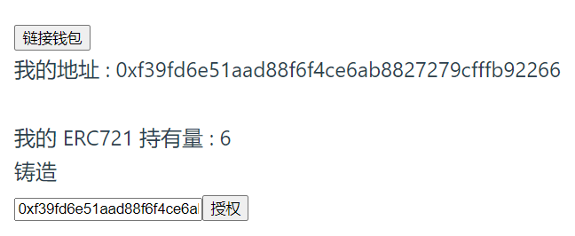

# 作业基于答案来修改，未部署在测试网 

## 该作业用到的ERC721是w3_2的JNFT

hardhat文件夹里有合约，在该文件夹中启动hardhat测试网并部署合约。 

vue-backend文件夹里，在src中有打印日志的几个js文件，其中后缀带self的是我写的。 

vue-backend/vue-project文件夹里，是我该写的前端页面，能够实现查看用户的ERC721持有量，并且能够mint（只有owner） 

## 页面: 

使用方法：
1. 进入hardhat文件夹，启动节点，部署合约
2. 进入vue-backend/src文件夹，启动实时读取事件的js文件（listenEvent_self.js）
3. 进入vue-backend/vue-project文件夹，启动前端

>点击mint，前端页面的持有量+1，同时后端读取到Transfer事件