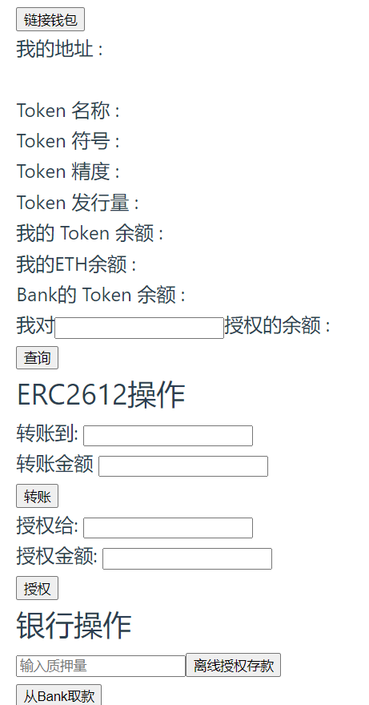

# 本次作业基于答案进行了改写，未部署到测试网上




## 个人修改的地方：<br>

增加:
- 查看Bank的Token余额
- 查询对某一地址的授权
- ERC2612授权操作
- 修改了bank合约，并加入withdraw功能


<br>

## 使用方法<br>

进入hardhat文件夹，
```
    npx hh node

    //部署合约
    npx hh run --network localhost scripts deploy_2612_bank.js
```

<br>

进入vue文件夹，
```
    npm run dev
```
启动页面

<br>

在小狐狸选定localhost网络，链id填入31337，导入hardhat默认账户的第一个账户。

完成以上步骤即可使用.